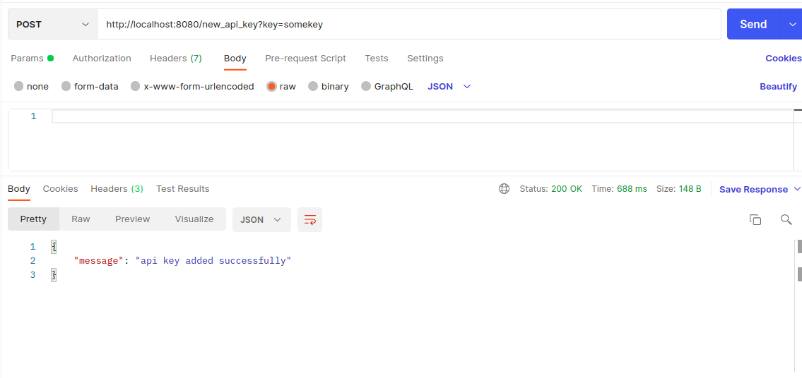

# YouTube Fetch and Search API

## Overview

This launches a Golang server locally that periodically fetches YouTube videos for a predefined query asynchronously and stores them in a MongoDB database. It also provides a REST API that can do the following:

1. Get the information of the videos stored in the database in a reverse chronological and paginated manner.
2. Search for stored videos in the database based on their titles and descriptions. The search query can be a full or partial match in any order. The server uses a score to display the most relevant results to least relevant results in a paginated manner.
3. Provide support for posting new YouTube API keys to the server. The server will automatically use the next valid key and update expiration of exhausted keys periodically.

Refer to the end of the README for examples of how to use the API.

## Optimizations

1. When we fetch videos from the YouTube API, it assigns every response an eTag which can be used to determine if already have had gotten the same response previously, which can be used to avoid unecesarrily inserts into the database.
2. The search API returns partially matched queries which are not in order by using MongoDB's text search feature to assign a score to the tokenized query against the title and description of the videos. The videos are then sorted by this score in a descending order.
3. The YouTube API keys expiration status is updated regularly in the background so that the keys can be reused after 24 hours.
4. The logs are stored in a file rather than the console so that they can be easily accessed and analyzed.

## How to run locally

### Prerequisites

1. Install [Golang's](https://golang.org/doc/install) latest version.
2. Install and run [MongoDB's](https://docs.mongodb.com/manual/installation/) latest version (recommended) or use MongoDB Cloud and set up a cluster.

### Steps

1. Follow this [wizard](https://console.developers.google.com/start/api?id=youtube) to create a new project and enable the YouTube Data API v3. Navigate to APIs and Services > Credentials and create a new API key.
2. Clone the repository.
3. Change the environment variables in the `.env` file to your own values.
4. To run locally - Start the server locally by running `make run` in the root directory of the project.
5. To run within a docket container - Build the docker image by running `make build-docker` in the root directory of the project. Then run `make run-docker` to start the server within a docker container. You can further `exec` into the container to access the logs via `docker exec -it <CONTAINER NAME> sh`.
6. Post the newly created API key via `curl -X POST -H "Content-Type: application/json" http://localhost:8080/new_api_key?key=<API_KEY>` to the server so that the server can start fetching latest youtube videos for the predefined query.

## Examples

### Get Videos

```
curl -X GET -H "Content-Type: application/json" http://localhost:8080/get_videos?page=1
```


### Search Videos

```
curl -X GET -H "Content-Type: application/json" http://localhost:8080/search_videos?query=ind+live&page=1
```


### Post API Key

```
curl -X POST -H "Content-Type: application/json" http://localhost:8080/new_api_key?key=<API_KEY>
```



### Logs

Here is how the logs will look like:


